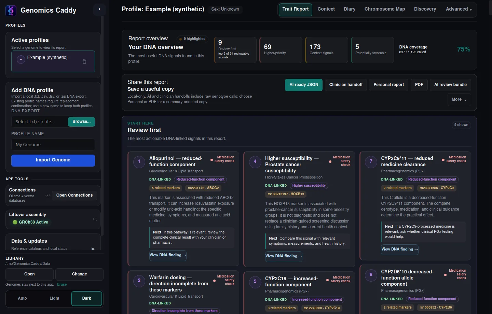
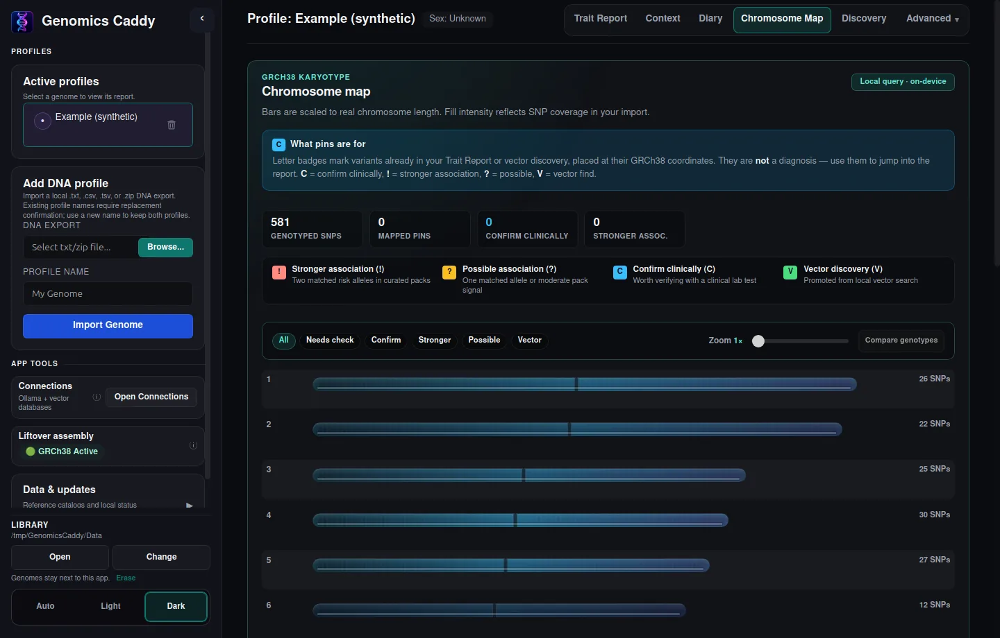

<p align="center">
  
</p>

<h1 align="center">Genomics Caddy</h1>

<p align="center">
  <strong>Local-first desktop DNA explorer.</strong><br>
  Import AncestryDNA or 23andMe SNP files, read Simple-first trait and
  pharmacogenomics reports on this machine, and optionally use Ollama or the
  built-in MCP server. Nothing is uploaded to us.
</p>

<p align="center">
  <a href="https://github.com/ImYourBoyRoy/genomics-caddy/releases/latest"></a>
  <a href="https://github.com/ImYourBoyRoy/genomics-caddy/actions/workflows/ci.yml"></a>
  
  
  
  <a href="LICENSE"></a>
</p>

<p align="center">
  <a href="https://github.com/ImYourBoyRoy/genomics-caddy/releases/latest"><strong>Download</strong></a>
  ·
  <a href="https://github.com/ImYourBoyRoy/genomics-caddy/issues">Issues</a>
  ·
  <a href="#install">Install</a>
  ·
  <a href="docs/usage/README.md">Usage</a>
  ·
  <a href="docs/mcp/README.md">MCP</a>
  ·
  <a href="LICENSE">License</a>
</p>

---

> **Research and education only — not a diagnostic or treatment product.** A
> consumer array call is an observation. It does not establish a disease, current
> hormone level, medication response, or care plan. High-stakes findings need
> validated clinical testing. AI chat and clinician/AI exports include the raw
> genotype calls behind the selected findings; share those files only with the
> person or system you intend.

<p align="center">
  
</p>
<p align="center"><sub>Trait report · Simple mode · left rail is import, profiles, catalogs, and library</sub></p>

<p align="center">
  
</p>
<p align="center"><sub>Chromosome map · same synthetic example · loops Dark / Light</sub></p>

## Install

You do **not** need git, Node, or Rust. Open the
**[latest GitHub Release](https://github.com/ImYourBoyRoy/genomics-caddy/releases/latest)**
and take **one** file for your OS.

### Windows

| | File | What you get |
| :--- | :--- | :--- |
| **Installer** | `*_x64-setup.exe` | Start Menu, uninstaller. *Install for me only* or *Install for everyone* (everyone needs administrator rights). |
| **Portable** | [`GenomicsCaddy-portable-windows.zip`](https://github.com/ImYourBoyRoy/genomics-caddy/releases/latest/download/GenomicsCaddy-portable-windows.zip) | Unzip and run `DNA-Tools.exe`. Keep `Data/` next to the exe. |

SmartScreen may warn on a new publisher: *More info* → *Run anyway*. WebView2 is
required. From v0.2.3, a portable copy **replaces itself** on update and leaves
`Data/` in place.

### Linux

| | File | What you get |
| :--- | :--- | :--- |
| **Portable (GitHub)** | `*_amd64.AppImage` | The Linux download on Releases. `Data/` stays next to the AppImage. |
| **Installer (local)** | `.deb` / `.rpm` | Menu/dock entry under `/usr`. **Not attached to GitHub Releases.** Build it with [compile instructions](compile_instructions.md), then install the package you built. Genomes go to `~/.local/share/Genomics Caddy/Data`. |

```bash
chmod +x Genomics.Caddy_*_amd64.AppImage
./Genomics.Caddy_*_amd64.AppImage
```

```bash
# after you built a .deb locally — not a Release asset
sudo apt install ./Genomics.Caddy_*_amd64.deb
```

### macOS

| | File | What you get |
| :--- | :--- | :--- |
| **Disk image** | `*_universal.dmg` | Folder with `Genomics Caddy.app` and `Data/` beside it. Tauri-signed, not Apple-notarized. |

Right-click the app → **Open** (or allow it under Privacy & Security).

Reference catalogs are **not** inside any of these files. Download them in the
app after it starts.

## First launch

1. Start Genomics Caddy.
2. Left sidebar → **Data & updates** → **Sync All Missing**. Wait until ClinVar,
   dbSNP, GWAS, PharmGKB, and companions show as downloaded **and indexed**.
   The two current ClinVar summary downloads total about 846 MB compressed; the
   local SQLite indexes need additional disk space. The downloader uses the
   server-reported size and measured transfer rate, and only resumes when the
   saved file and remote byte range still match.
3. Typical AncestryDNA / 23andMe files are GRCh37. **Liftover assembly** →
   **Download chain** so coordinates can map to GRCh38.
4. Import your `.txt`, `.csv`, `.tsv`, or ZIP from the sidebar. Read the
   pre-write review, then confirm. Parsing alone does not write a profile.
5. Read **Simple** mode first. Use **Clinical** or **Compare** for sources and
   technical detail.
6. Fill **Context** / **Diary** yourself if you want food, gut, cycle, menopause,
   postpartum, supplement, or medication prompts. DNA does not infer those.
   Report cards use compact, authored context badges when a finding is
   biologically or life-stage relevant; extra badges stay behind `+N more`.

If every finding looks empty or “unknown,” catalogs are usually still indexing.
Stay on **Data & updates** until that finishes, then reopen the profile.

The desktop shell adapts to the available WebView viewport, including high-DPI
display scaling. Longer startup, import, and welcome surfaces remain
reachable through their scroll regions instead of being clipped.

Signed builds offer in-app updates. Confirm before download. The updater does
not upload DNA.

## Where genomes live

| How you launched it | Default library |
| :--- | :--- |
| Windows portable zip | `Data/` next to `DNA-Tools.exe` |
| Windows *Install for me only* | `Data/` next to the installed exe |
| Windows *Install for everyone* | `%LOCALAPPDATA%\Genomics Caddy\Data` |
| Linux AppImage | `Data/` next to the AppImage |
| Linux `.deb` / `.rpm` | `~/.local/share/Genomics Caddy/Data` |
| macOS DMG | `Data/` next to the `.app` |

Change it from the sidebar **Library** row. To wipe a portable copy, use
**Erase** there, or delete the folder that contains the app and `Data/`.

## What it does

- Imports AncestryDNA / 23andMe style files locally, with a review step before
  anything is saved
- Scores curated marker packs into Simple, Clinical, and Compare reports
- Adds a compact, expandable index of ClinVar condition labels, GWAS traits,
  ClinGen gene–disease validity, and pharmacogenomic response links, with each
  relationship’s evidence scope kept explicit
- Scans all imported calls locally against ClinVar variant and condition-specific
  submission indexes, then groups exact allele matches by condition and review
  status. This is distinct from curated pack coverage and is not a diagnosis or
  a personal-risk estimate; known somatic/oncogenic records are excluded.
- Shows POTS/dysautonomia as symptom and clinician-evaluation context only; it
  does not score a consumer-DNA POTS risk model or recommend treatment.
- Keeps food, gut, supplement, medication, menopause, and postpartum prompts
  conditional on context *you* enter
- Prioritizes clinical follow-ups and expands deeper lists only when needed
- Optional local [Ollama chat](docs/ai-chat/README.md)
- Optional [MCP server](docs/mcp/README.md) for agents: `DNA-Tools --mcp`

Screenshots above use a **synthetic** example genome, not a real person’s DNA.
Simple mode is the public-safe view (no raw calls on the cards).

## Docs

| If you want to… | Read |
| :--- | :--- |
| Import DNA, read reports, export | [Usage](docs/usage/README.md) |
| Wire Claude / Cursor / another agent | [MCP](docs/mcp/README.md) |
| Connect Ollama or vector research | [AI chat](docs/ai-chat/README.md) |
| Build from source or ship a signed update | [Build](docs/build/README.md) |
| Clone the repo, tests, lock-free install | [Development](docs/development/README.md) |
| Build a `.deb` / `.rpm` or extra OS package | [Compile instructions](compile_instructions.md) |
| File map | [ARCHITECTURE.md](ARCHITECTURE.md) |
| Cite this software | [CITATION.cff](CITATION.cff) |

## License

People may use and share this for **noncommercial** purposes. Companies may not
use it commercially. See [LICENSE](LICENSE)
([PolyForm Noncommercial 1.0.0](https://polyformproject.org/licenses/noncommercial/1.0.0)).

---

Created by **Roy Dawson IV** · <Roy.Dawson.IV@gmail.com> · [GitHub](https://github.com/imyourboyroy) · [PyPI](https://pypi.org/user/ImYourBoyRoy/)
