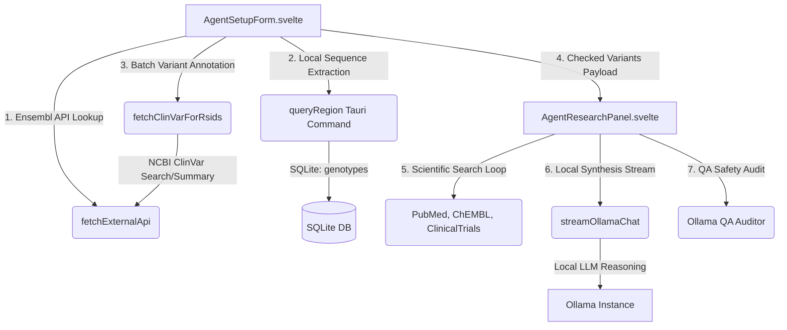

# Genomics Research Agent: System Pathways & Data Flow

This document details the complete data flow, files, APIs, local database queries, and Tauri commands executing behind the **Genomics Research Agent** section of Genomics Caddy. It is designed to provide Codex or other research agents with a comprehensive roadmap of the system.

---

## 🗺️ Architectural Overview & File Map

The Genomics Research Agent operates as a local agentic loop within a Svelte 5 + Rust Tauri environment. All genomic sequence files and RAG vector libraries reside locally in SQLite. External lookups are proxied through Rust to bypass CORS and leverage caching.



### Core Source Files
1. **Frontend UI Components**:
   - [`src/lib/components/agent/AgentResearchPanel.svelte`](src/lib/components/agent/AgentResearchPanel.svelte): The central manager coordinating forms, running terminal views, and displaying reports.
   - [`src/lib/components/agent/AgentSetupForm.svelte`](src/lib/components/agent/AgentSetupForm.svelte): Form selector managing single-target queries, predefined catalog filters, and Deep Gene Region scanning.
   - [`src/lib/components/agent/AgentQuickLaunch.svelte`](src/lib/components/agent/AgentQuickLaunch.svelte): Shortcut panel for high-impact report markers.
   - [`src/lib/components/agent/AgentRunner.svelte`](src/lib/components/agent/AgentRunner.svelte): Terminal visualization rendering real-time progress steps.
   - [`src/lib/components/agent/AgentReportView.svelte`](src/lib/components/agent/AgentReportView.svelte): Display container for Markdown reports and the QA validation audit checklist.

2. **Agent Logic & Prompt Builders**:
   - [`src/lib/utils/agentApis.ts`](src/lib/utils/agentApis.ts): API fetching utilities for Ensembl, ClinVar, PubMed, ClinicalTrials, ChEMBL, and prompt assembly helpers.

3. **Rust Tauri backend & SQLite bindings**:
   - [`src-tauri/src/db.rs`](src-tauri/src/db.rs): SQLite schema initializer, `query_region` query, and RAG vector `search_evidence` mappings.
   - [`src-tauri/src/lib.rs`](src-tauri/src/lib.rs): Tauri RPC endpoint definitions (`query_region`, `fetch_external_api`, `stream_ollama_chat`).

4. **Curated Reference Catalog**:
   - [`src/lib/marker-packs/discovery_catalog.json`](src/lib/marker-packs/discovery_catalog.json): Static catalog of 30 high-impact clinical variants (MTHFR, BRCA1/2, APOE, DPYD, SLCO1B1) used during catalog discovery.

---

## ⚡ Data Flow: Deep Gene Region Scan

When a user selects the **Deep Gene Region** scan tab in `AgentSetupForm` and inputs a gene symbol (e.g. `MTHFR`), the system executes a 4-step discovery pipeline:

### Step 1: Ensembl Coordinate Resolution
- The frontend makes an HTTP request to Ensembl's open lookup API:
  `https://rest.ensembl.org/lookup/symbol/homo_sapiens/{Gene}?content-type=application/json`
- This is wrapped in the Tauri client proxy `fetchExternalApi` with a 24-hour cache limit (`ttlSecs = 86400`).
- The response returns the sequence region name (chromosome), start, and end coordinates in the GRCh38 assembly:
  ```json
  {
    "seq_region_name": "1",
    "start": 11785729,
    "end": 11806102
  }
  ```

### Step 2: SQLite Regional Genotype Extraction
- The resolved coordinates are forwarded to the Tauri IPC command `queryRegion`:
  ```typescript
  queryRegion(sampleId, chromosome, start, end)
  ```
- The Rust backend queries the local SQLite `genotypes` table:
  ```sql
  SELECT sample_id, rsid, chromosome, position_grch37, position_grch38, allele1, allele2 
  FROM genotypes 
  WHERE sample_id = ? AND chromosome = ? AND position_grch38 >= ? AND position_grch38 <= ?
  ORDER BY position_grch38 ASC
  ```
- This retrieves all user genotypes present in the sequence region (typically 50-250 SNPs for standard genes).

### Step 3: High-Throughput Batch ClinVar Cross-Referencing
- The list of rsIDs returned from SQLite is chunked into arrays of size 40 in `fetchClinVarForRsids`.
- For each chunk, the client queries NCBI E-utilities:
  1. **Esearch**: Search for matching ClinVar Variation IDs:
     `https://eutils.ncbi.nlm.nih.gov/entrez/eutils/esearch.fcgi?db=clinvar&term={rs1}[Variant+Name]+OR+{rs2}[Variant+Name]...&retmode=json`
  2. **Esummary**: Fetch traits and clinical significance for the Variation IDs:
     `https://eutils.ncbi.nlm.nih.gov/entrez/eutils/esummary.fcgi?db=clinvar&id={ids}&retmode=json`
- **rsID Extraction Logic**:
  The summary records return nested variation locations. The code resolves rsIDs via `variation_loc.dbSNP` field mapping, falling back to regex extraction from the record's title (`summary.title.match(/rs\d+/i)`) if missing.
- **Traits Mapping**:
  Phenotypes are extracted from `summary.trait_set` list name parameters and matched back to the genotype's rsID key.

### Step 4: Active Variant Filtering & UI checklist
- Active clinical significance description (e.g. "pathogenic", "likely pathogenic", "risk factor", "association", "conflicting") is checked against the user genotype.
- Variants are sorted to bubble pre-checked risk markers to the top.
- Renders the list in the Svelte DOM.

---

## 🔄 Data Flow: Multi-Variant synthesis Loop

Once a set of discovered variants is selected, clicking **Start Agentic Research** launches the asynchronous coordinator loop in `AgentResearchPanel.svelte`:

### Step 1: Retrieve Carried Genomic Risk Markers
- The selected variants are compiled into an array. ClinVar traits and clinical significance descriptions resolved in the previous scan are forwarded to avoid redundant NCBI calls.

### Step 2: Gather Multilocus ClinVar & dbSNP Annotations
- Reuses cached ClinVar details (for region scans) or queries NCBI for catalog items.

### Step 3: Scan PubMed Scientific Literature
- Compiles a logical search query based on the set of unique genes (e.g. `(MTHFR OR COMT) AND human`).
- Queries PubMed E-utilities:
  - `esearch.fcgi?db=pubmed&term={Query}&retmode=json&retmax=3`
  - `esummary.fcgi?db=pubmed&id={Ids}&retmode=json`
- Returns title, authors, journal, year, and URLs.

### Step 4: Search Recruiting Clinical Trials
- Queries the ClinicalTrials.gov API v2 study registry:
  `https://clinicaltrials.gov/api/v2/studies?query.term={Genes}&pageSize=3`
- Returns official study title, NCT number, status, sponsor, and design phases.

### Step 5: Extract Target Pathway Compounds (ChEMBL)
- Queries the EMBL-EBI ChEMBL REST API for the first three genes:
  `https://www.ebi.ac.uk/chembl/api/data/molecule.json?q={Gene}&limit=3&format=json`
- Returns therapeutic names, molecule types, and max trial phases.

### Step 6: Generate Advanced Cross-System Report (LLM Stream)
- The compiled database records, ClinVar annotations, PubMed articles, ChEMBL compounds, and clinical trials are injected into the prompt template `buildDiscoverySynthesisPrompt`.
- This template instructs the reasoning model to focus on:
  - Systemic cross-mapping: overlapping metabolic cycles (e.g. folate conversion intersecting catecholamine clearance speeds).
  - Multi-system risks (e.g. BRCA1 cancer risk alongside chemotherapy PGx DPYD tolerances).
  - Safe, supportive lifestyle and dietary cofactors (e.g. methylfolate and BH4).
- The prompt is dispatched to Tauri endpoint `stream_ollama_chat` which starts a SSE stream returning chunks:
  - Frontend listens to `ollama-chunk` Tauri event listener to append token segments to the UI report text.
  - Listen to `ollama-done` event to complete the step.

### Step 7: Execute Quality Assurance Safety Audit
- The completed report text is forwarded to `buildValidationPrompt` which checks for:
  - Medical claim diagnoses (e.g. asserting "you have cancer").
  - Drug dosage recommendations.
  - The presence of a medical disclaimer at the bottom.
- Dispatches a non-streamed check to Ollama.
- Displays validation badges ("Approved & Verified" or "Warning - Revisions Recommended") with audit comments in the audit panel.

---

## 🔌 Tauri IPC Commands & API Contracts

All frontend invocations route through standard IPC wrappers in [`src/lib/api/tauri.ts`](src/lib/api/tauri.ts):

### 1. `fetchExternalApi`
- **Rust Implementation**: `fetch_external_api` in `src-tauri/src/lib.rs`.
- **Contract**:
  ```typescript
  fetchExternalApi(url: string, apiKey?: string, ttlSecs?: number): Promise<any>
  ```
- **Description**: Uses Rust `reqwest` client. Caches successful HTTP responses in a local memory cache using the `ttlSecs` key (default 1 hour).

### 2. `queryRegion`
- **Rust Implementation**: `query_region` in `src-tauri/src/db.rs`.
- **Contract**:
  ```typescript
  queryRegion(sampleId: number, chromosome: string, start: number, end: number): Promise<DbSnpRecord[]>
  ```
- **Description**: Accesses SQLite file directly, querying sequence records between the base-pair ranges on the specified chromosome.

### 3. `streamOllamaChat`
- **Rust Implementation**: `stream_ollama_chat` in `src-tauri/src/lib.rs`.
- **Contract**:
  ```typescript
  streamOllamaChat(url: string, token: string | undefined, model: string, messages: any[], temperature?: number, numPredict?: number): Promise<void>
  ```
- **Description**: Establishes a POST request to Ollama `/api/chat` using `reqwest::Client`. Reads chunks and triggers Tauri events (`ollama-chunk`, `ollama-done`) back to the Svelte thread.
